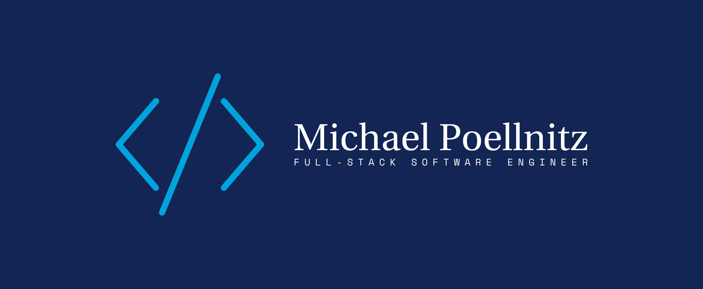

<!--
**MikePCodes/MikePCodes** is a ✨ _special_ ✨ repository because its `README.md` (this file) appears on your GitHub profile.

Here are some ideas to get you started:

- 🔭 I’m currently working on ...
- 🌱 I’m currently learning ...
- 👯 I’m looking to collaborate on ...
- 🤔 I’m looking for help with ...
- 💬 Ask me about ...
- 📫 How to reach me: ...
- 😄 Pronouns: ...
- ⚡ Fun fact: ...
-->

<h1 align="center">Hi,  I'm Mike</h1>
<h3 align="center">I'm a software engineer that specializes in full-stack web development</h3>

  

- 👨‍💻 My portfolio is available <a href ="https://mpwebdev.netlify.app/">here</a>

<h3 align="left">Connect with me:</h3>

<h3 align="left">Languages and Tools:</h3>

    

